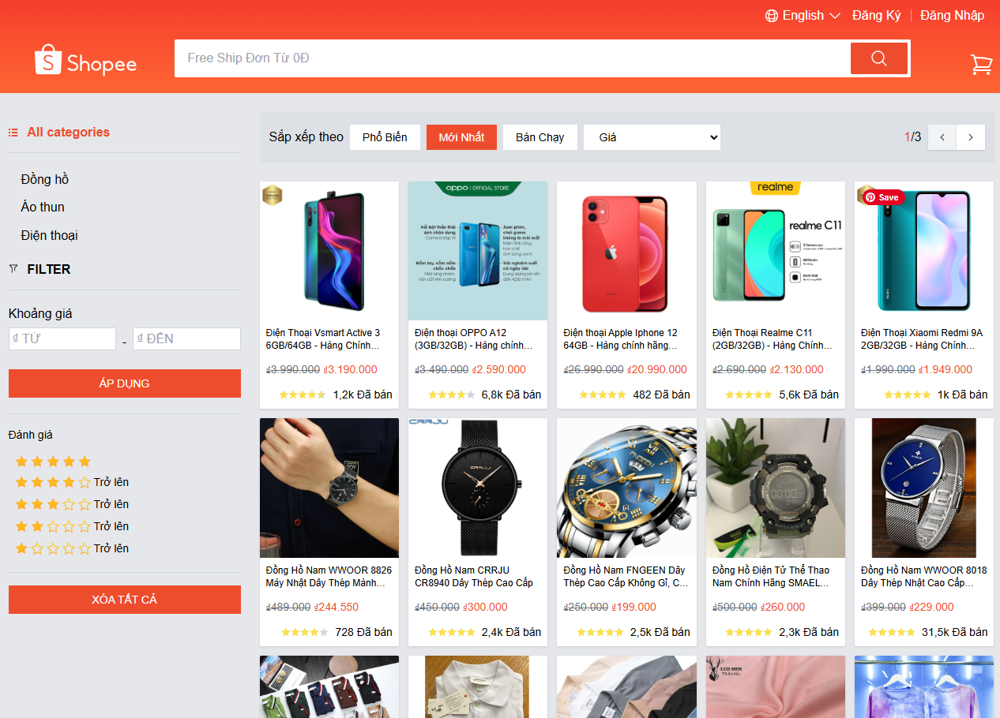
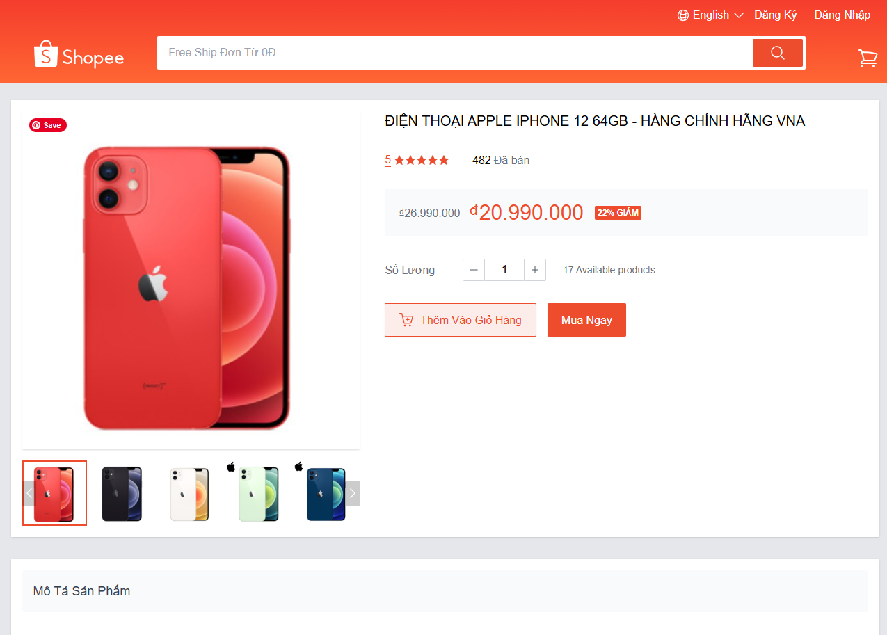
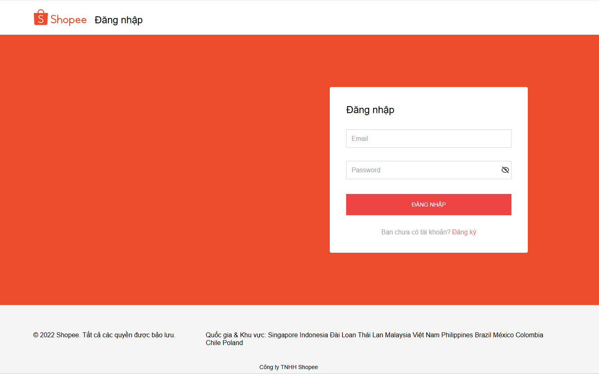

# 🛍️ Shopee Clone E-Commerce Platform



A comprehensive, full-stack e-commerce frontend clone inspired by Shopee. Built with a modern React and TypeScript stack to deliver a seamless, high-performance shopping experience.

## ✨ Key Features

### 🔐 Authentication & Security (JWT)
- **Robust Registration & Login**: Secure user onboarding and session management.
- **Account Protection**: Handled via industry-standard JSON Web Tokens (JWT).
- **Logout Operations**: Safe session termination.

### 🏪 Product Discovery & Browsing
- **Advanced Pagination & Sorting**: Effortlessly navigate through large product catalogs.
- **Dynamic Filtering**: Narrow down search results based on specific product attributes.
- **Fuzzy Search**: Quickly discover products with an efficient search implementation.
- **Showcase Gallery**: See the application interface below.
  
  

### 📦 Product Details
- **Comprehensive Product Profiles**: View detailed attributes, specifications, and availability.
- **Interactive Image Viewer**: Features an integrated image slider with a magnifying glass hover effect.
- **Rich Text Descriptions**: Fully rendered WYSIWYG HTML descriptions for accurate product details.
- **One-Click Add-to-Cart**: Streamlined purchasing flow.

### 🛒 Shopping Cart & Order Management
- **Cart Tracking**: Add, edit quantities, and remove items with real-time updates.
- **Checkout Process**: Complete purchase workflows.
  
  

### 👤 Customer Profile
- **Personal Information Management**: Update addresses and contact info.
- **Avatar Customization**: Upload and manage profile pictures.
- **Security Updates**: Secure password reset functionality.
- **Order Tracking**: End-to-end visibility of current and past order status.

## 🛠️ Technology Stack

This project leverages modern tooling to ensure high maintainability, performance, and developer experience.

| Category | Technology |
|---|---|
| **Core** | React 18, TypeScript |
| **Build Tooling** | Vite (Lightning-fast HMR and optimized builds) |
| **Styling & UI** | Tailwind CSS, Headless UI |
| **State Management** | React Query (Async/Server state), Context API (Client state) |
| **Form Handling** | React Hook Form (with Yup validation) |
| **Routing** | React Router v6 |
| **API** | Axios (RESTful API integration) |
| **Internationalization** | React i18next (Multi-language support) |
| **SEO Optimization** | React Helmet Async |
| **Component Driven** | Storybook (UI component modeling) |
| **Testing** | Vitest, React Testing Library |

## 🚀 Getting Started

Follow these steps to run the project locally.

### Prerequisites
- [Node.js](https://nodejs.org/) (v16+ recommended)
- Use `npm` package manager.

### Installation

1. **Clone the repository** (if you haven't already):
   ```bash
   git clone https://github.com/khang110/shoppeclone.git
   cd shopeeclone
   ```

2. **Install dependencies**:
   ```bash
   npm install
   ```

3. **Start the development server**:
   ```bash
   npm run dev
   ```

The application will be available at `http://localhost:5173/`.
